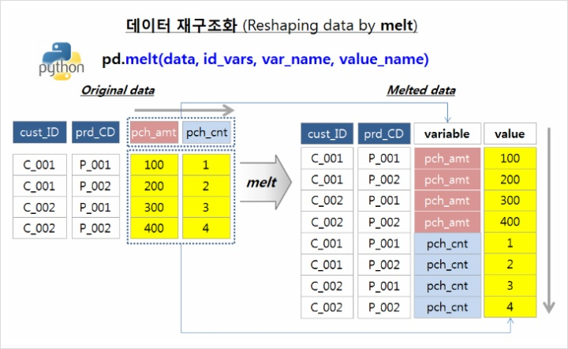
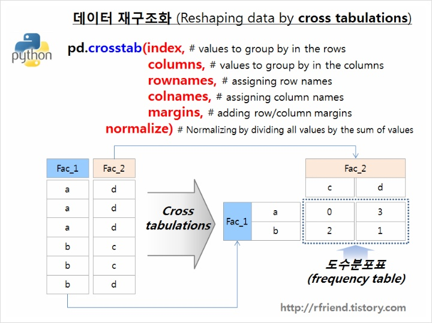
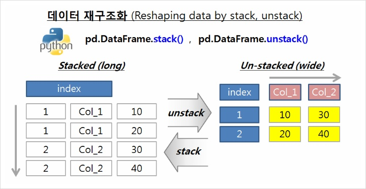

# Data전처리 with pandas

## 1. 데이터 생성
### 1) Dataframe만들기

<li> 2차 배열 : ndarray</li>
<code>dt =pd.DataFrame(np.array([[1, 2, 3], [4, 5, 6]]))</code>

><table><tr><td></td><td>0</td><td>1</td><td>2</td></tr>
><tr><td>0</td><td>1</td><td>2</td><td>3</td></tr>
><tr><td>1</td><td>4</td><td>5</td><td>6</td></tr></table>

<li>  Dictionany </li>
<code>dt = pd.DataFrame({"A":[1,4,7], "B":[2,5,8], "C":[3,6,9]})</code>

><table><tr><td></td><td>A</td><td>B</td><td>C</td></tr>
><tr><td>0</td><td>1</td><td>2</td><td>3</td></tr>
><tr><td>1</td><td>4</td><td>5</td><td>6</td></tr>
><tr><td>2</td><td>7</td><td>8</td><td>9</td></tr></table>

<li>   Dataframe </li>
<code>dt = pd.DataFrame(data=[4,5,6,7], index=range(0,4), columns=['A'])</code>

><table><tr><td>idx</td><td>A</td></tr>
><tr><td>0</td><td>4</td></tr>
><tr><td>1</td><td>5</td></tr>
><tr><td>2</td><td>6</td></tr>
><tr><td>3</td><td>7</td></table>

<li> Series : pandas에서 제공하는 데이터타입, index있는 1차원배열 </li>
<code>dt = pd.Series({"United Kingdom":"London", "India":"New Delhi", "United States":"Washington", "Belgium":"Brussels"})</code>

><table><tr><td></td><td>0</td></tr>
><tr><td>United Kingdom</td><td>London </td></tr>
><tr><td>India</td><td>New Delhi</td></tr>
><tr><td>United States</td><td>Washington</td></tr>
><tr><td>Belgium</td><td>Brussels</td></tr></table>

### 2) Data불러오기
<code>data=pd.read_csv('data/weather.txt',sep='\t')</code>

<li> sep : 구분자 </li>
<li> index_col : index지정해주기 </li>
<li> name, header : column명이 없을때 만들어줌.  첫번째행이 컬럼명이면 header=0으로 지정                <tap>ex ) name=['ID','name','age'], header=None </li>

 

## 2. Data 살펴보기

### 1) info
<code>data.info()</code>

> <class 'pandas.core.frame.DataFrame'>  
>  MultiIndex: 33 entries, (1, 30) to (12, 6) 
> Data columns (total 1 columns):  
> value    33 non-null float64  
> dtypes: float64(1) 
> memory usage: 1.7 KB

### 2) describe
<pre><code>data.describe(include='object')
data.describe(include='all')
</code></pre>

><table>
<tr><td></td><td>	value</td></tr>
<tr><td>count</td><td>	33.000000</td></tr>
<tr><td>mean</td><td>	219.212121</td></tr>
<tr><td>std</td><td>	20.897081</td></tr>
<tr><td>min</td><td>	171.000000</td></tr>
<tr><td>25%</td><td>	205.000000</td></tr>
<tr><td>50%</td><td>	216.500000</td></tr>
<tr><td>75%</td><td>	231.500000</td></tr>
<tr><td>max</td><td>	265.000000</td></tr>
</table>

### 3) head & tail : 처음 & 끝의 데이터 일부행 출력
<pre><code>data.head()
data.tail().describe()</code></pre>

### 4) sample : random data 1개
<code> data.sample() </code>

## 3. Data 재구조화(reshape)

### 1) melt
 
<pre><code>pd.melt(data, id_vars=['cust_ID', 'prd_CD'],var_name='pch_CD', value_name='pch_value')
</code></pre>

cust_ID, prd_CD 은 남겨두고 나머지를 key(컬럼명) value(값)을 새로운 두개의 컬럼으로 만듬

++ 이미지 추가

### 2) crosstab
 
갯수 한번에 세어주는거 (groupby처럼 쓸수있음)

<pre><code>pd.crosstab(tips.sex, tips.smoker) >> 인덱스(1st)와 컬럼(2nd)
pd.crosstab(tips.sex, tips.smoker, margins=True) >> all값도 보고싶을때
pd.crosstab(tips.sex, tips.smoker, values=tips.tip, aggfunc=np.mean)
</code></pre>

### 3) stack
 
<li>numpy의 stack : dataframe을 서로 붙여줌 (hstack, vstack, dstack, concatenate) </li>
<li>pandas의 stack : 인덱스를 컬럼으로 변경 (stack, unstack)</li>

<pre><code>a.stack() 
np.hstack([a,b.rshape(150,-1)])</code></pre>

### 4) pivot, pivot_table
 
pivot은 안되고 pivot_table은 되는 경우
<li>index가 2개 이상인 경우</li>
<li>columns가 2개 이상인 경우</li>
<li>중복값이 있는 경우</li>
<li>margins(합계)가 필요한 경우</li>

