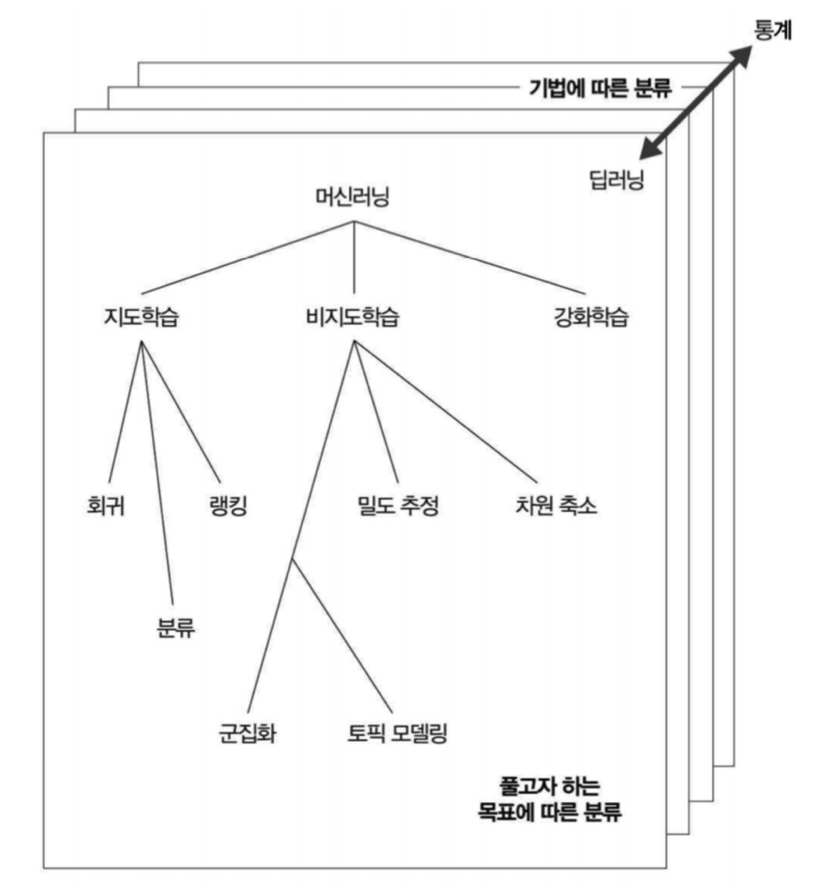
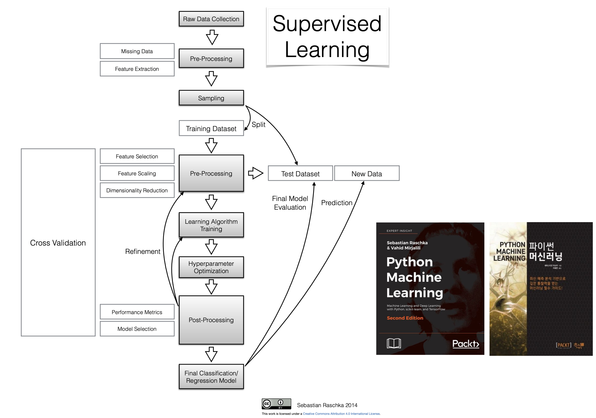
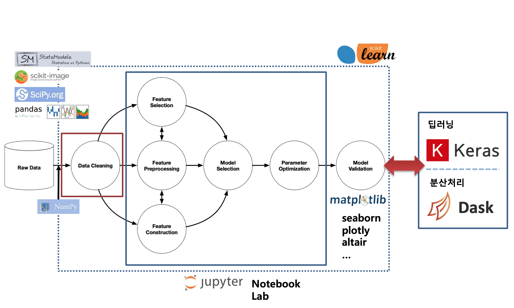

# Machine Learning

- 머신러닝

1. 지도학습 : Supervised learing 
>a. 회귀 : Regression 
>b.  분류 : Classification  
>c.  랭킹 

2. 비지도학습 : Unsupervised learning 

3. 강화학습 : Reinforcement learning 

[ - scikit-learn](sklearn.md) 