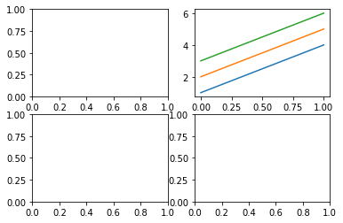
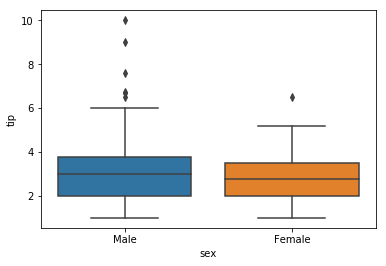

# 시각화

## 1) Seaborn

#### a. heatmap (상관분석)
<pre><code>import seaborn as sns
iris = sns.load_dataset('iris')
iris.corr()  >>  1에 가까울수록 관련있음 
sns.heatmap(iris.corr(), )
</code></pre>

#### b. pairplot
<pre><code>sns.pairplot(iris, hue='species')  >> supervised learning</pre></code>

#### c. FacetGrid

<pre><code>t=sns.FacetGrid(tips,'sex') 
t.map(plt.scatter,  'tip',  'total_bill')
</pre></code>

#### d. PairGrid
- PairGrid안되면 FacetGrid 사용할것
<pre><code>s= sns.PairGrid(tips)  >> 숫자데이터들만 모든조합할수있는 그리드 만들어줌 
s.map_diag(plt.hist)  >> 대각선 그래프만 만들어줌
</code></pre>

## 2) matplotlib
#### a. 기본
<pre><code>import matplotlib.pyplot as plt
plt.plot([1,2,3],[4,5,6],label='aaa')  >> x좌표, y좌표 
plt.legend(loc=3)  >> 범례 위치 지정
</pre></code>

#### b. figure
<pre><code>plt.figure(figsize=(10,2))
plt.axes((0,0,1,1)) 
plt.axes([0.3,0.3,0.5,0.5])
plt.title('Star') 
plt.grid(True, color='r')
plt.xlim(1,4)  >> x limit 
plt.yticks([]) 
plt.xticks([])
</code></pre>

#### c. subplot
<pre><code>plt.subplot(2,2,1)
plt.subplot(2,2,2)
plt.plot([[1,2,3],[4,5,6]])
plt.subplot(2,2,3)
plt.subplot(2,2,4)
</code></pre>

##  3) others
<pre><code>tips.groupby('size')['tip'].size().plot.pie() </code></pre>

<pre><code>tips.plot(kind='box')
tips.plot.box() </code></pre>

<pre><code>sns.boxplot(x='sex',y='tip', data=tips) </code></pre>

<pre><code>sns.violinplot(x='sex',y='tip', data=tips) </code></pre>

<pre><code>sns.swarmplot(x='tip', y='day', data=tips) </code></pre>

<pre><code>sns.scatterplot(x='tip', y='day', data=tips) </code></pre>

<pre><code>sns.relplot(x='day', y='total_bill', data=tips , hue='time'</code></pre>

- 비교사이트 : [http://pythonplot.com/](http://pythonplot.com/)